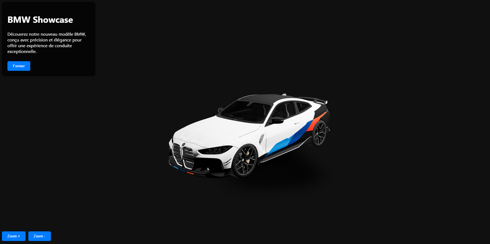

# Showcase 3D with Three.js 🚗🎮

## Description 📝

This project is an interactive 3D showcase built with **Three.js**, a JavaScript library for creating and displaying 3D graphics in the browser. The primary goal of this project is to practice working with Three.js and demonstrate how to integrate 3D elements into a showcase website.

The project features an interactive 3D model of a car (BMW) that users can explore, zoom in/out, and manipulate within a virtual environment using mouse controls and scroll wheel. Integrating 3D elements into a showcase website can provide an immersive and engaging user experience, allowing users to visualize products dynamically and interactively.

## Features ✨

- **Interactive 3D Model**: Users can rotate, zoom, and explore the car model using mouse interactions.
- **Interactive Menu**: A presentation menu can be opened and closed to show additional information about the car.
- **Zoom Controls**: Users can zoom in and out on the model using the scroll wheel or zoom buttons.
- **Presentation Details**: A button allows users to close the presentation menu and discover more details about the car model.

## Goals 🎯

- Practice integrating 3D models into web applications.
- Create an interactive and immersive experience for a showcase website.
- Explore the possibilities of Three.js for displaying and interacting with 3D objects.
- Use **React** and **Three.js** for a modern and dynamic approach to web development.

## Prerequisites 🛠️

Before getting started, ensure you have the following tools installed on your machine:

- **Node.js**: [Download Node.js](https://nodejs.org/)
- **npm** (Node.js package manager): This comes with Node.js.

## Installation ⚡

1. Clone this repository to your local machine:

   ```bash
   git clone https://github.com/your-username/showcase-car-3d.git
   ```
2. Navigate into the project directory:
   ```bash
   cd showcase-car-3d/client
   ```
3. Install the necessary dependencies:
   ```bash
   npm install
   ```
4. Start the development server:
   ```bash
   npm start
   ```
5. Open your browser and go to the following URL to view the project:
   ```bash
   http://localhost:3000
   ```

## Usage 👨‍💻
Once the server is running and the webpage is open, you can:

- **Explore the 3D Model:** Use your mouse to interact with the car model. You can rotate it to view it from different angles.
- **Zoom In and Out:** Use the scroll wheel to zoom in and out on the model. You can also use the zoom buttons on the screen to adjust the model's size.
- **Presentation Menu:** The presentation menu contains additional information about the car. You can open or close it by clicking the menu button. A hamburger icon appears to re-open the menu once it's closed.

## Technologies Used 🔧

- **Three.js:** JavaScript library for creating and displaying 3D graphics in the browser.
- **React:** JavaScript library for building user interfaces.
- **React Three Fiber:** A React wrapper for Three.js that enables declarative 3D rendering with React.
- **@react-three/drei:** A collection of useful helpers and components for working with Three.js and React Three Fiber.
- **Lucide React:** A lightweight React icon library used for the menu icon.

## Authors 👨‍💻
**Lucas NEGRE:** Currently training to become a full-stack developer at [Holberton School](https://www.holbertonschool.com/).